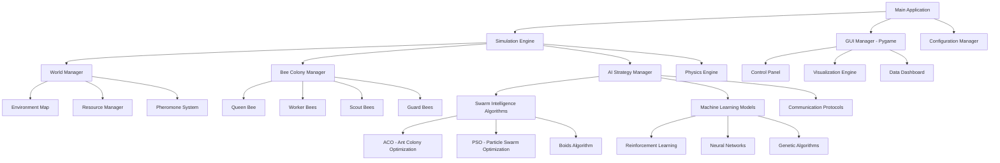
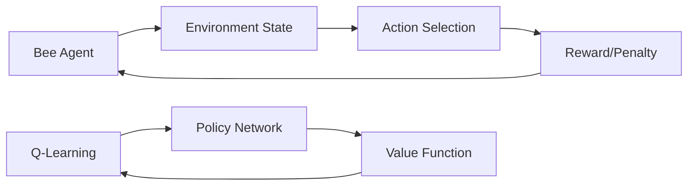

# 🐝 Bee Swarm Intelligence Simulator - Szczegółowy Plan Architektury

## 🎯 Cel Projektu
Stworzenie pełnej symulacji naukowej pszczół z dokładnymi modelami biologicznymi, implementacją różnych algorytmów swarm intelligence i machine learning, z możliwością eksperymentów naukowych.

**WAŻNE**: Projekt będzie rozwijany iteracyjnie - zaczynamy od prostej wersji i stopniowo dodajemy zaawansowane funkcjonalności.

## 🏗️ Architektura Systemu

### Wzorce Projektowe
- **Strategy Pattern** - przełączanie algorytmów AI/ML (tylko jeden aktywny naraz)
- **Observer Pattern** - system logowania i powiadomień
- **Factory Pattern** - tworzenie różnych typów pszczół i obiektów środowiska
- **Command Pattern** - obsługa akcji GUI
- **Singleton Pattern** - zarządzanie stanem symulacji

### Główne Komponenty



## 🚀 Fazy Rozwoju Projektu

### Faza 1: Podstawy (MVP - Minimum Viable Product)
**Cel**: Działający podstawowy symulator z prostymi pszczołami
- Podstawowa mapa 2D z ulem i kwiatkami
- Proste pszczoły robotnice z podstawowym AI
- Podstawowa wizualizacja pygame
- System konfiguracji
- Podstawowe testy

### Faza 2: Swarm Intelligence
**Cel**: Implementacja klasycznych algorytmów rojowych
- System feromonów
- Algorytm ACO (Ant Colony Optimization)
- Algorytm Boids
- Komunikacja między pszczołami
- Ulepszony interface użytkownika

### Faza 3: Machine Learning
**Cel**: Dodanie ML i zaawansowanych algorytmów
- Reinforcement Learning
- Sieci neuronowe
- Algorytmy genetyczne
- System przełączania strategii
- Zaawansowana analiza danych

### Faza 4: Naukowa Symulacja
**Cel**: Pełna symulacja z modelami biologicznymi
- Realistyczne modele biologiczne
- Zaawansowany system środowiska
- Kompleksowe narzędzia analizy
- Eksport danych naukowych
- Dokumentacja naukowa

## 🧬 Technologie i Biblioteki

### Core Technologies
- **Python 3.9+** - język główny
- **Pygame** - GUI i wizualizacja
- **NumPy** - obliczenia numeryczne
- **SciPy** - algorytmy naukowe

### Machine Learning (Faza 3+)
- **TensorFlow/Keras** - deep learning
- **scikit-learn** - classical ML
- **NEAT-Python** - neuroevolution
- **DEAP** - evolutionary algorithms

### Dodatkowe Narzędzia
- **pytest** - testy jednostkowe
- **logging** - system logowania
- **configparser** - zarządzanie konfiguracją
- **matplotlib** - wykresy i analiza danych
- **Pillow** - manipulacja obrazów

## 📁 Struktura Projektu (Docelowa)

```
bee_simulator/
├── src/
│   ├── core/
│   │   ├── __init__.py
│   │   ├── simulation_engine.py     # Główny silnik symulacji
│   │   ├── world_manager.py         # Zarządzanie światem gry
│   │   ├── physics_engine.py        # Silnik fizyki
│   │   └── event_system.py          # System zdarzeń
│   │
│   ├── entities/
│   │   ├── __init__.py
│   │   ├── base_entity.py           # Klasa bazowa dla wszystkich entities
│   │   ├── bee/
│   │   │   ├── __init__.py
│   │   │   ├── bee_base.py          # Bazowa klasa pszczoły
│   │   │   ├── queen_bee.py         # Królowa
│   │   │   ├── worker_bee.py        # Robotnica
│   │   │   ├── scout_bee.py         # Zwiadowca
│   │   │   ├── guard_bee.py         # Strażnik
│   │   │   └── bee_factory.py       # Factory do tworzenia pszczół
│   │   │
│   │   └── environment/
│   │       ├── __init__.py
│   │       ├── hive.py              # Ul
│   │       ├── flower.py            # Kwiatki
│   │       ├── obstacle.py          # Przeszkody
│   │       └── weather.py           # System pogody
│   │
│   ├── intelligence/
│   │   ├── __init__.py
│   │   ├── strategy_manager.py      # Wzorzec Strategy - TYLKO JEDEN ALGORYTM NARAZ
│   │   ├── swarm_algorithms/
│   │   │   ├── __init__.py
│   │   │   ├── aco.py              # Ant Colony Optimization
│   │   │   ├── pso.py              # Particle Swarm Optimization
│   │   │   ├── boids.py            # Algorytm Boids
│   │   │   └── collective_decision.py # Podejmowanie decyzji grupowych
│   │   │
│   │   ├── machine_learning/
│   │   │   ├── __init__.py
│   │   │   ├── neural_networks.py   # Sieci neuronowe
│   │   │   ├── reinforcement_learning.py # RL
│   │   │   ├── genetic_algorithm.py # Algorytmy genetyczne
│   │   │   └── neuroevolution.py   # Neuroewolucja
│   │   │
│   │   └── communication/
│   │       ├── __init__.py
│   │       ├── pheromone_system.py  # System feromonów
│   │       ├── waggle_dance.py      # Taniec pszczół
│   │       └── chemical_signals.py  # Sygnały chemiczne
│   │
│   ├── environment/
│   │   ├── __init__.py
│   │   ├── map_generator.py         # Generator map
│   │   ├── terrain_types.py         # Typy terenu
│   │   ├── resource_distribution.py # Rozmieszczenie zasobów
│   │   └── environmental_factors.py # Czynniki środowiskowe
│   │
│   ├── gui/
│   │   ├── __init__.py
│   │   ├── main_window.py           # Główne okno
│   │   ├── control_panel.py         # Panel kontrolny
│   │   ├── visualization/
│   │   │   ├── __init__.py
│   │   │   ├── renderer.py          # Silnik renderowania
│   │   │   ├── bee_renderer.py      # Renderowanie pszczół
│   │   │   ├── environment_renderer.py # Renderowanie środowiska
│   │   │   └── pheromone_renderer.py # Renderowanie feromonów
│   │   │
│   │   └── widgets/
│   │       ├── __init__.py
│   │       ├── slider.py            # Custom slider
│   │       ├── button.py            # Custom button
│   │       ├── graph.py             # Wykresy w czasie rzeczywistym
│   │       └── bee_inspector.py     # Inspektor pszczoły
│   │
│   ├── data/
│   │   ├── __init__.py
│   │   ├── data_collector.py        # Zbieranie danych
│   │   ├── statistics.py            # Statystyki symulacji
│   │   ├── export_manager.py        # Eksport danych
│   │   └── analysis_tools.py        # Narzędzia analizy
│   │
│   ├── utils/
│   │   ├── __init__.py
│   │   ├── math_utils.py            # Narzędzia matematyczne
│   │   ├── vector.py                # Klasa wektorów 2D
│   │   ├── logger.py                # System logowania
│   │   ├── config.py                # Zarządzanie konfiguracją
│   │   └── performance.py           # Monitoring wydajności
│   │
│   └── main.py                      # Punkt wejścia aplikacji
│
├── tests/
│   ├── __init__.py
│   ├── test_entities/
│   │   ├── __init__.py
│   │   ├── test_bee_behavior.py
│   │   ├── test_hive_operations.py
│   │   └── test_environment.py
│   │
│   ├── test_intelligence/
│   │   ├── __init__.py
│   │   ├── test_swarm_algorithms.py
│   │   ├── test_machine_learning.py
│   │   └── test_communication.py
│   │
│   ├── test_gui/
│   │   ├── __init__.py
│   │   ├── test_rendering.py
│   │   └── test_user_interface.py
│   │
│   └── test_integration/
│       ├── __init__.py
│       ├── test_full_simulation.py
│       └── test_performance.py
│
├── config/
│   ├── simulation_config.ini        # Konfiguracja symulacji
│   ├── ai_config.ini               # Konfiguracja AI
│   ├── gui_config.ini              # Konfiguracja GUI
│   └── logging_config.ini          # Konfiguracja logowania
│
├── data/
│   ├── maps/                       # Predefiniowane mapy
│   ├── experiments/                # Dane eksperymentów
│   ├── logs/                       # Logi symulacji
│   └── exports/                    # Eksportowane dane
│
├── docs/
│   ├── api_documentation.md
│   ├── user_manual.md
│   ├── algorithm_descriptions.md
│   └── biological_models.md
│
├── requirements.txt                # Zależności Python
├── setup.py                       # Instalacja pakietu
├── README.md                       # Dokumentacja projektu
└── .gitignore                     # Git ignore
```

## 🧠 Algorytmy Swarm Intelligence (Wzorzec Strategy)

### Ważne: System Przełączania Algorytmów
**Tylko jeden algorytm jest aktywny w danym momencie**. Użytkownik może przełączać między algorytmami przez GUI.

### 1. Ant Colony Optimization (ACO)
- **Zastosowanie**: Optymalizacja tras do źródeł nektaru
- **Implementacja**: Feromony cyfrowe, evaporacja, wzmacnianie ścieżek
- **Parametry**: Intensywność feromonów, współczynnik evaporacji, eksploracja vs eksploatacja

### 2. Particle Swarm Optimization (PSO)
- **Zastosowanie**: Optymalizacja pozycji i zachowań pszczół
- **Implementacja**: Velocity i position updates, social i cognitive components
- **Parametry**: Inertia weight, social/cognitive coefficients

### 3. Boids Algorithm
- **Zastosowanie**: Naturalny ruch roju
- **Implementacja**: Separation, alignment, cohesion
- **Parametry**: Promieny wpływu, siły oddziaływania

### 4. Collective Decision Making
- **Zastosowanie**: Wybór nowych miejsc na ul, podział pracy
- **Implementacja**: Quorum sensing, taniec pszczół
- **Parametry**: Próg kworum, siła sygnału

## 🤖 Machine Learning Components (Dostępne jako opcje)

### 1. Reinforcement Learning


**Parametry**: Learning rate, discount factor, exploration rate

### 2. Neural Networks
- **Feed-forward networks** - podstawowe decyzje
- **LSTM networks** - pamięć długoterminowa
- **Convolutional networks** - rozpoznawanie wzorców środowiska

**Parametry**: Liczba warstw, rozmiar warstw, funkcje aktywacji

### 3. Genetic Algorithms
- **Ewolucja strategii** - selekcja, krzyżowanie, mutacja
- **Optymalizacja parametrów** - współczynniki algorytmów

**Parametry**: Rozmiar populacji, współczynnik mutacji, typ selekcji

### 4. Neuroevolution (NEAT)
- **Ewolucja sieci neuronowych** - topologia i wagi
- **Adaptacyjne zachowania** - automatyczne uczenie się

**Parametry**: Rozmiar populacji, współczynniki mutacji struktury/wag

## 🗺️ System Środowiska

### Typy Terenu
```python
class TerrainType(Enum):
    FLOWER_FIELD = "flower_field"      # Bogate źródła nektaru
    WASTELAND = "wasteland"            # Nieprzyjazny teren
    WATER = "water"                    # Źródło wody
    FOREST = "forest"                  # Przeszkody i schronienie
    HIVE_AREA = "hive_area"           # Obszar ula
```

### Mapa Dynamiczna
- **Procedural generation** - automatyczne generowanie map
- **Seasonal changes** - zmiany sezonowe
- **Weather effects** - wpływ pogody na zachowania

## 📊 System Logowania i Analizy

### Tracking Individual Bees
```python
class BeeLogger:
    def track_bee(self, bee_id: str, action: str, position: Vector2D, 
                  energy: float, pheromone_level: float)
    def get_bee_history(self, bee_id: str) -> List[BeeEvent]
    def analyze_bee_efficiency(self, bee_id: str) -> EfficiencyReport
```

### Metryki Roju
- **Efficiency metrics** - wydajność zbierania nektaru
- **Communication analysis** - analiza komunikacji
- **Survival statistics** - statystyki przeżywalności
- **Learning progress** - postęp w uczeniu się

## 🎮 Interface Użytkownika

### Real-time Controls
- **Speed control** - regulacja prędkości symulacji
- **Algorithm switcher** - **DROPDOWN MENU** do wyboru algorytmu (tylko jeden aktywny)
- **Parameter sliders** - regulacja parametrów wybranego algorytmu w czasie rzeczywistym
- **Bee inspector** - śledzenie konkretnych pszczół

### Visualizations
- **Pheromone trails** - wizualizacja śladów feromonowych
- **Energy levels** - poziomy energii pszczół
- **Communication patterns** - wzorce komunikacji
- **Performance graphs** - wykresy wydajności
- **Algorithm indicator** - wyświetla aktualny algorytm

## 🔬 Modele Biologiczne (Faza 4)

### Realistyczne Zachowania Pszczół
- **Cykl życia** - różne fazy rozwoju
- **Hierarchia społeczna** - role w ulu
- **Komunikacja chemiczna** - feromony alarmowe, znaczniki
- **Termoregulacja** - utrzymanie temperatury ula
- **Seasonal behavior** - zachowania sezonowe

### Ekosystem
- **Food webs** - sieci pokarmowe
- **Predator-prey relationships** - drapieżnik-ofiara
- **Environmental stressors** - stresory środowiskowe
- **Disease modeling** - modelowanie chorób

## 📋 Plan Implementacji

### Milestone 1: Podstawowy Symulator (2-3 tygodnie)
- [ ] Podstawowa struktura projektu
- [ ] Prosta mapa z ulem i kwiatkami
- [ ] Podstawowe pszczoły z prostym AI
- [ ] Podstawowa wizualizacja pygame
- [ ] Konfiguracja i testy

### Milestone 2: Swarm Intelligence (3-4 tygodnie)
- [ ] System feromonów
- [ ] Algorytm ACO
- [ ] Algorytm Boids
- [ ] System przełączania strategii
- [ ] Ulepszony interface

### Milestone 3: Machine Learning (4-5 tygodni)
- [ ] Reinforcement Learning
- [ ] Sieci neuronowe
- [ ] Algorytmy genetyczne
- [ ] Zaawansowana analiza danych
- [ ] Performance optimization

### Milestone 4: Naukowa Symulacja (6+ tygodni)
- [ ] Realistyczne modele biologiczne
- [ ] Zaawansowane środowisko
- [ ] Narzędzia naukowe
- [ ] Dokumentacja i walidacja

## 🎯 Kluczowe Założenia Projektowe

1. **Modularność** - każdy komponent może być rozwijany niezależnie
2. **Testowalność** - wszystkie funkcjonalności mają testy
3. **Konfigurowalność** - parametry można zmieniać bez zmiany kodu
4. **Wydajność** - symulacja działa płynnie z tysiącami pszczół
5. **Rozszerzalność** - łatwe dodawanie nowych algorytmów i funkcji
6. **Użyteczność naukowa** - możliwość prowadzenia rzeczywistych eksperymentów

## 📚 Literatura i Źródła

### Swarm Intelligence
- "Swarm Intelligence" - Bonabeau, Dorigo, Theraulaz
- "Particle Swarm Optimization" - Kennedy & Eberhart
- "Ant Colony Optimization" - Dorigo & Stützle

### Machine Learning
- "Reinforcement Learning: An Introduction" - Sutton & Barto
- "Deep Learning" - Goodfellow, Bengio, Courville
- "Evolutionary Computation" - De Jong

### Biologia Pszczół
- "The Biology of the Honey Bee" - Winston
- "Honeybee Democracy" - Seeley
- "The Buzz about Bees" - Tautz

---

**Ten projekt łączy informatykę, biologię i sztuczną inteligencję w fascynujący sposób, pozwalając na eksplorację tajemnic inteligencji rojowej!** 🐝🧠🤖