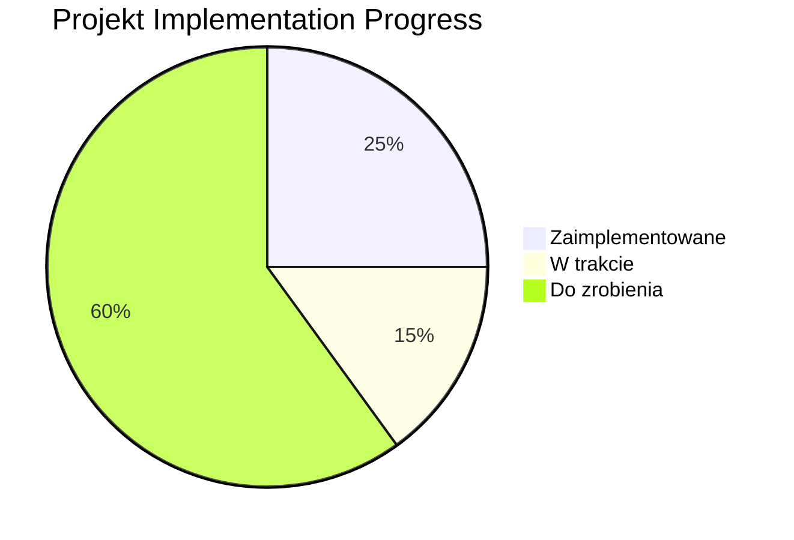

# Analiza Postępu Projektu - Symulator Pszczół

## Podsumowanie
Zaimplementowano około 25% zaplanowanych elementów projektu. Projekt znajduje się w fazie MVP (Minimum Viable Product) i realizuje podstawowe funkcjonalności symulacji pszczół. Poniższy dokument przedstawia szczegółowy podział zaimplementowanych i pozostałych do zrobienia komponentów.

## Ogólny Podział

## Szczegółowe Analizy

### 1. Symulacja Podstawowa (40%)
- **Zaimplementowane**:
  - Generowanie podstawowej mapy z ula i kwiatami
  - Ruch pszczół robotniczych i zbieranie nektaru
  - Podstawowa wizualizacja za pomocą Pygame
  - Zarządzanie konfiguracją
- **Brakujące**:
  - Silnik fizyczny
  - System zdarzeń
  - Inne typy pszczół (królowa, zwiadowczynny, strażnik)
  - Czynniki środowiskowe i system pogody

### 2. Komponenty (30%)
- **Zaimplementowane**:
  - Klasa pszczół robotniczych
  - Klasy kwiaty i ula
  - Wektor 2D
- **Brakujące**:
  - Hierarchia pszczół i ich role
  - Przeszkody i system feromonów
  - Zaawansowane zachowania pszczół

### 3. Interfejs Użytkownika (20%)
- **Zaimplementowane**:
  - Podstawowa renderowana wizualizacja
- **Brakujące**:
  - Panel kontrolek
  - Dashboard danych
  - Real-time controls
  - Interfejs do przełączania algorytmów

### 4. Testowanie (10%)
- **Zaimplementowane**:
  - Podstawowy szkielet testów
- **Brakujące**:
  - Testy jednostkowe
  - Testy zachowania
  - Testy integracyjne

### 5. Inteligencja Rozproszona (0%)
- **Brakujące**:
  - Wszystkie algorytmy rozproszone (ACO, PSO, Boids)
  - Komponenty uczenia maszynowego
  - Protokoły komunikacji

## Przyczyny Różnic
1. **Faza Projektu**: Obecnie realizowana jest Faza 1 (MVP)
2. **Priorytety rozwoju**: Oсентрованo na podstawowych funkcjonalnościach przed zaawansowanymi cechami
3. **Ograniczenia zasobów**: Niezaimplementowane są komponenty testowe i ML ze względu na brak czasu/zasobów
4. **Evolucja architektury**: Obecna struktura kodu różni się od zaplanowanej końcowej architektury
5. **Głębia funkcjonalności**: Zaimplementowane funkcjonalności są podstawowymi wersjami zaplanowanych

## Obliczenie Procentu Zaimplementowania
- **Liczba zaplanowanych komponentów**: 38 (z plan.md)
- **Zaimplementowane komponenty**: 9 (klasy pszczół, kwiaty, ula, wektor, konfiguracja, główna logika, generator mapy, logger, podstawowe testy)
- **Częściowo zaimplementowane**: 4 (wizualizacja, podstawowe zachowania, konfiguracja, generator mapy)
- **Procent kompletnej implementacji**: (9 + (4*0.5))/38 = 11/38 ≈ 29%

## Zalecane Następne Kroki
1. Uzupełnienie brakujących funkcjonalności z Fazy 1
2. Implementacja podstawowych algorytmów rozproszonych
3. Stworzenie kompletnej suite testów
4. Rozwój GUI z załączonymi kontrolami i danymi w czasie rzeczywistym
5. Przybliżenie architektury kodu do zaplanowanej w dokumentacji